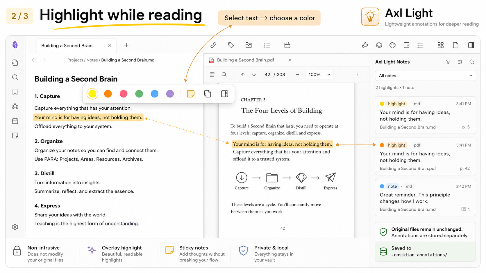

# 墨光批注

墨光批注是一款非侵入式 Obsidian 阅读批注插件，支持 Markdown 和 PDF 文件。它提供覆盖层高亮、便签栏、批注概览、搜索跳转和 Markdown 导出功能，同时保持原始文档不变。

**本插件绝不会修改你的 Markdown 或 PDF 文件。** 批注数据单独存储在 `.obsidian-annotations/` 目录下的 sidecar JSON 文件中。

## 最新版本：v0.5.0

### 新增功能

- ✅ **编辑器旁便签栏**：在 Markdown 编辑器右侧显示便签卡片，支持 Markdown 渲染
- ✅ **便签行内编辑**：点击铅笔按钮直接编辑便签内容，按 `Cmd/Ctrl + Enter` 保存
- ✅ **窄屏自动隐藏**：当编辑器宽度低于设定阈值时，便签栏自动隐藏，由弹层接管
- ✅ **六种颜色主题**：便签支持黄色、橙色、粉色、绿色、蓝色、紫色六种颜色
- ✅ **暗色模式支持**：便签样式适配 Obsidian 暗色主题

### 技术改进

- 新增 `StickyNoteLane` 类管理便签栏生命周期
- 整合 `positioning.ts` 避让算法和 `stickyNoteView.ts` 卡片组件
- 监听 `active-leaf-change` 和 `layout-change` 事件自动渲染

## 功能特性

- 覆盖层高亮：支持 Markdown 实时预览、源码模式、阅读视图和 PDF
- 移动端友好的阅读视图高亮恢复，支持延迟渲染和 DOM 观察
- 浮动工具栏：六种颜色、便签、复制和批注概览操作
- 编辑器旁便签栏：支持 Markdown 渲染笔记，窄屏自动隐藏
- 便签和侧栏笔记的行内编辑：按 `Cmd/Ctrl + Enter` 快捷保存
- 侧栏批注概览：搜索、颜色筛选、排序、跳转、删除、添加笔记和导出
- Sidecar JSON 存储，支持模糊文本锚点重定位
- Windows 安全路径规范化和重命名迁移处理

## 安装方式

### BRAT 安装

1. 安装 Obsidian BRAT 插件
2. 运行 `BRAT: Add a beta plugin for testing`
3. 粘贴本仓库 URL：

```text
https://github.com/rezonegame/yh-inklight
```

4. 在 `设置 → 第三方插件` 中启用 `墨光批注`

### 快速安装

在终端中运行以下命令，将路径替换为你的 Obsidian 仓库路径：

```bash
curl -fsSL https://raw.githubusercontent.com/rezonegame/yh-inklight/main/scripts/install.sh | bash -s -- "$HOME/Documents/Obsidian Vault"
```

然后重启 Obsidian，打开 设置 → 第三方插件，启用 墨光批注。


### 手动安装

1. 从最新 Release 下载以下三个文件：
   https://github.com/rezonegame/yh-inklight/releases/latest

   - `main.js`
   - `manifest.json`
   - `styles.css`

2. 将它们移动到：
   `<你的仓库>/.obsidian/plugins/axl-light/`

3. 重启 Obsidian

4. 设置 → 第三方插件 → 启用 "墨光批注"

**不要**从绿色 `Code` 按钮下载源代码 ZIP。Obsidian 需要的是构建后的 Release 文件。

## 使用方法

### 高亮文本

在 Markdown 或 PDF 中选择文本，使用浮动工具栏选择颜色、添加便签、复制选区或打开批注概览。



### 编辑便签

打开右侧便签栏或批注概览，点击铅笔按钮行内编辑笔记，按 `Cmd/Ctrl + Enter` 保存。


### 搜索、跳转和导出

使用批注概览搜索高亮和笔记、跳转回源位置、删除批注、为已有高亮添加笔记，或将所有内容导出为新的 Markdown 笔记文件。

## 命令

- `高亮选中文本`：`Cmd/Ctrl + Shift + H`
- `为选区添加便签`：`Cmd/Ctrl + Alt + M`
- `切换便签栏`：`Cmd/Ctrl + Shift + N`
- `打开批注概览`

## 数据存储

墨光批注将批注存储在你的仓库中：

```text
.obsidian-annotations/
  index.json
  notes__reading__book.md.json
  papers__example.pdf.json
```

Sidecar 文件包含锚点、选中文本、颜色、便签内容、可选标题、时间戳和 PDF 页面矩形信息。

你的原始 `.md` 和 `.pdf` 文件保持不变。即使禁用或卸载插件，文档也不会被修改。

## 已知限制

- 阅读视图的高亮基于渲染后的 DOM 文本匹配，因此不常见的主题或大量重写渲染 HTML 的插件可能会影响高亮位置。
- PDF 支持依赖于 Obsidian 内置 PDF 查看器的 DOM 结构。
- PDF 文本选择和矩形锚点在旋转页面或特殊 PDF 布局下可能需要改进重定位。
- 大量批注集目前直接在侧栏中渲染，虚拟滚动计划中。

## 开发

```bash
npm install
npm run dev
```

生产构建：

```bash
npm run build
```

将 `main.js`、`manifest.json` 和 `styles.css` 复制到：

```text
<你的仓库>/.obsidian/plugins/axl-light/
```

## 许可证

MIT。详见 [LICENSE](LICENSE)。

## 引用来源

本插件的功能实现参考了以下开源项目的设计理念：

- [Obsidian Highlighter](https://github.com/chrisgrieser/obsidian-highlighter) — 非侵入式高亮和侧边栏批注
- [Obsidian Annotator](https://github.com/ivan-lednev/obsidian-annotator) — PDF 注释和便签管理
- [Obsidian Sticky Notes](https://github.com/DeathAwe/obsidian-sticky-notes) — 便签卡片和排版算法
